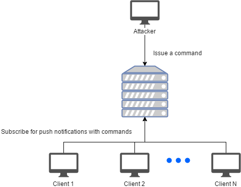
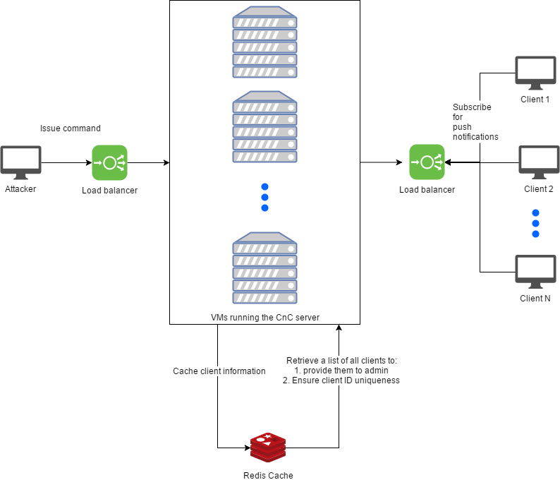

# About

The module contains a standalone CnC server capable of running any environment supporting Node.js.

# Single server execution

In order to run, execute the following command

```
    node app.js
```

Once the server starts, you can find it under `http://localhost:666`.
Note that the self signed SSL certificate is generated only for localhost. If you decide to deploy
the application to a remote server, you'll have to generate a new certificate.

# Endpoints

## GET /clients

List all currently connected clients/bots

```
[
	{
		"id": "ySIK7CfvsgJ0mOtYAAAA",
		"os": {
			"type": "windows",
			"version": "10.0.16299"
		}
	}
]
```

## GET /clients/:clientId/files?path=/

### Content-Type: application/json

Allows you to browse the file system of a client. Displays all files and directories under
the path specified in the query parameter. In case the path `/` is specified for a client running on windows,
a list of drives is returned.

```
[
	{
		"path": "C:",
		"type": "dir"
	}
]
```

### Content-Type: any, but application/json

Allows you to download a file from a remote bot.



# Multi-server execution

In order to scale up, the application requires a Redis instance to exchange the data about
connected clients.

To enable such mode, run 

```
    node app.js --redis=redis://<redis url>
```

